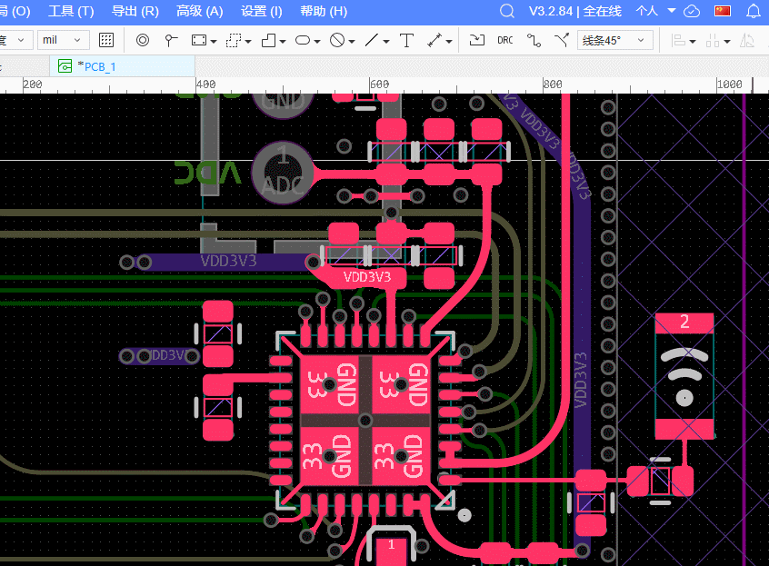
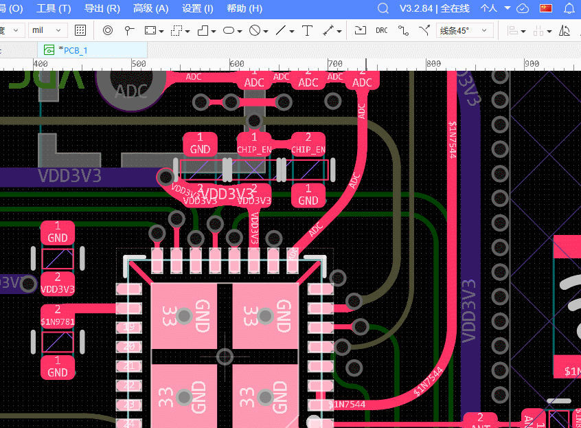

# 更好的PCB元件导线删除器

嘉立创 EDA 专业版 (EasyEDA Pro) 扩展插件，用于快速删除与选中 PCB 元件连接的指定网络走线。

## 功能特性

- **网络选择式删除**: 选中元件后弹出网络列表，由用户勾选要删除哪些网络的走线
- **二次确认**: 选择网络后弹出确认对话框，显示已选网络列表，防止误删
- 使用 `getEntireTrack()` 追踪整条走线，删除干净不留残段
- 支持批量选中多个元件同时处理

---
- 删除部分



- 删除全部




## 安装

1. 下载 `.eext` 扩展包
2. 在嘉立创 EDA 专业版中，点击菜单 `扩展` -> `扩展管理`
3. 点击 `从本地安装`，选择下载的扩展包

## 使用方法

### 删除连接导线

1. 在 PCB 编辑器中选中一个或多个元件
2. 点击菜单 `导线删除器` -> `删除连接导线`
3. 在弹出的网络选择对话框中，勾选需要删除走线的网络
4. 点击确定后，弹出确认对话框显示已选网络
5. 确认后自动删除选中网络的走线

## 菜单位置

- **首页**: `导线删除器` -> `删除连接导线` / `关于`
- **PCB 编辑器**: `导线删除器` -> `删除连接导线` / `关于`

## 技术说明

### 工作原理

1. 获取选中的 PCB 元件
2. 遍历元件的所有焊盘，收集网络名称
3. 弹出多选对话框，让用户选择要删除的网络
4. 弹出确认对话框，显示已选网络列表
5. 对选中网络的焊盘，通过 `getConnectedPrimitives()` 获取直接连接的图元
6. 调用 `getEntireTrack()` 获取完整走线，批量删除

## 环境要求

- 嘉立创 EDA 专业版 >= 3.0.0

## 开发

```bash
# 安装依赖
npm install

# 编译
npm run compile

# 构建扩展包
npm run build

# 代码检查
npm run lint
```

## 许可证

Apache-2.0
